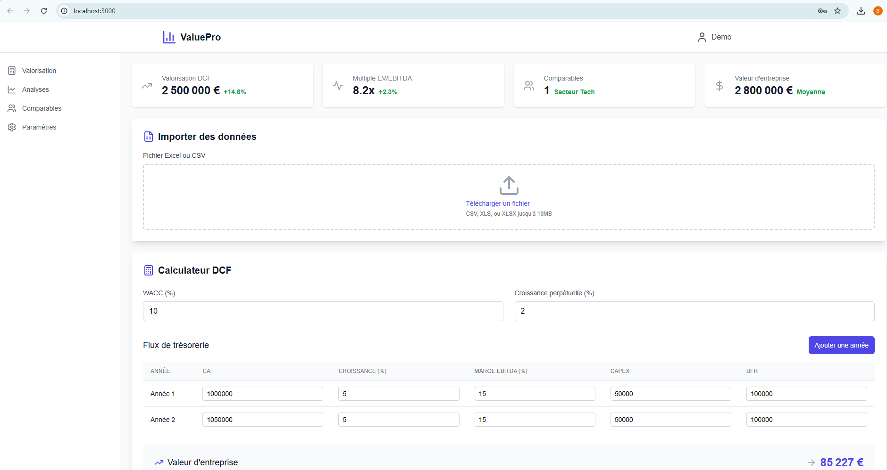
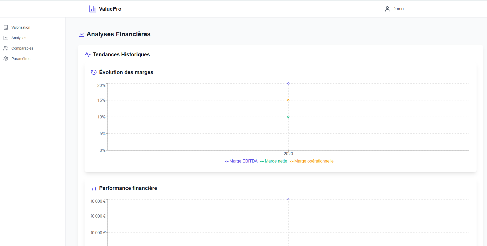

# ValuePro - Application d'Analyse de Valorisation d'Entreprise

Une application web professionnelle pour l'analyse et la valorisation d'entreprises, intégrant des méthodes DCF et comparables.

## Fonctionnalités

- 🔐 Authentification sécurisée
- 📊 Analyse DCF (Discounted Cash Flow)
- 📈 Analyse des comparables
- 📉 Analyse de sensibilité
- 📋 Import de données (CSV/Excel)
- 📱 Interface responsive
- 📊 Visualisations interactives
- 📑 Génération de rapports

## Technologies Utilisées

- React.js avec TypeScript
- Tailwind CSS pour le design
- Recharts pour les graphiques
- XLSX et PapaParse pour l'import de données

## Installation

```bash
# Cloner le repository
git clone https://github.com/Bechir-Mathlouthi/valuepro.git

# Installer les dépendances
cd valuepro
npm install

# Lancer l'application
npm run dev
```

## Utilisation

1. Connexion
   - Email : demo@valuepro.com
   - Mot de passe : demo12345

2. Import des données
   - Format CSV/Excel supporté
   - Exemple de données fourni dans `example-data.csv`

3. Analyse
   - Valorisation DCF
   - Analyse des comparables
   - Analyse de sensibilité
   - Génération de rapports

## Structure des Données

Le fichier d'import doit contenir :
- Informations de l'entreprise
- Données financières
- Historique
- Comparables
- Ratios financiers

## Screenshots





## Licence

MIT

## Contact

Bechir Mathlouthi - [GitHub](https://github.com/Bechir-Mathlouthi)